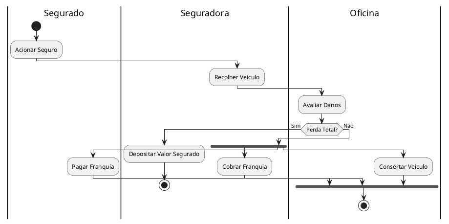

# Exemplo de um prompt
**Cenário: Processo de Acionamento de Seguro e Reparação de Veículo**

**Descrição do Processo:**
- O segurado aciona o seguro.
- A seguradora recolhe o veículo.
- A oficina avalia os danos do veículo.
- Se for constatada perda total, a seguradora deposita o valor segurado e o processo é finalizado.
- Caso contrário, a seguradora cobra a franquia.
- O segurado paga a franquia.
- A oficina conserta o veículo.
- O processo é finalizado após o conserto do veículo.

**Atores e Ações:**
Segurado: Acionar Seguro, Pagar Franquia.
Seguradora: Recolher Veículo, Depositar Valor Segurado, Cobrar Franquia.
Oficina: Avaliar Danos, Consertar Veículo.
Atividades Paralelas:

As atividades de "Cobrar Franquia", "Pagar Franquia" e "Consertar Veículo" são realizadas em paralelo.

# Exemplo de código PlantUML

